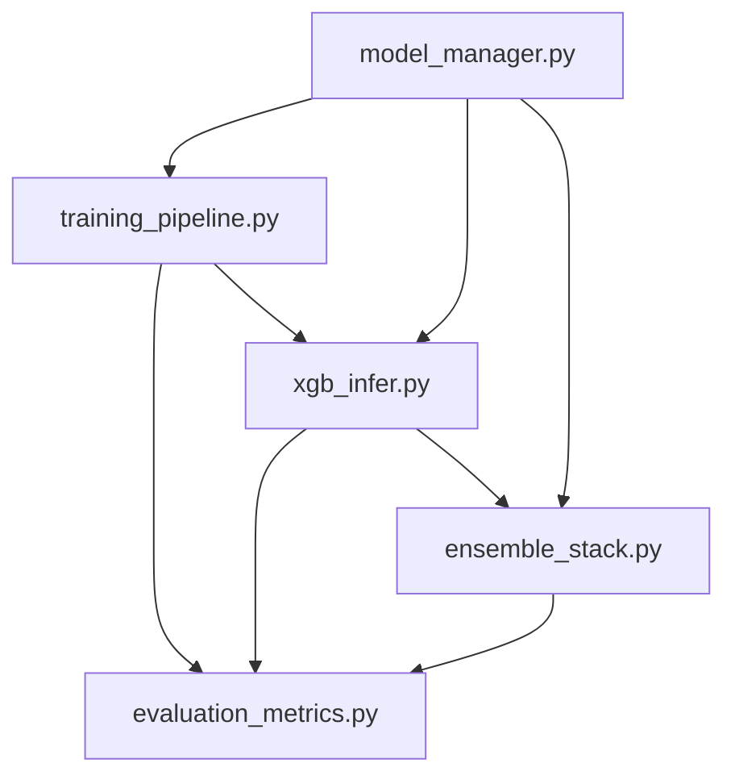

# Model Dependencies and Call Relationships

## Overview
This document outlines the dependencies and call relationships between components in the models directory.

## Dependency Graph



## Detailed Call Relationships

### 1. Model Manager (model_manager.py)
Core component for model persistence and versioning.

**Called By:**
- `training_pipeline.py`:
  - `save_model()` - Saves trained models
  - `load_model()` - Loads models for evaluation
  - `get_version_info()` - Retrieves model metadata

- `xgb_infer.py`:
  - `load_model()` - Loads models for inference
  - `get_version_info()` - Checks model compatibility

- `ensemble_stack.py`:
  - `load_model()` - Loads base models
  - `save_model()` - Saves ensemble models

### 2. Training Pipeline (training_pipeline.py)
Handles model training and hyperparameter optimization.

**Calls:**
- `model_manager.py`:
  - `save_model()` - Saves trained models
  - `load_model()` - Loads previous versions

- `evaluation_metrics.py`:
  - `compute_classification_metrics()` - Evaluates model performance
  - `compute_financial_metrics()` - Computes financial metrics

**Called By:**
- `xgb_infer.py`:
  - `train_model()` - Retrains models if needed

### 3. XGBoost Inference (xgb_infer.py)
Handles model inference and prediction.

**Calls:**
- `model_manager.py`:
  - `load_model()` - Loads models for inference
  - `get_version_info()` - Checks model versions

- `ensemble_stack.py`:
  - `predict()` - Gets ensemble predictions
  - `update_weights()` - Updates ensemble weights

- `evaluation_metrics.py`:
  - `compute_classification_metrics()` - Evaluates predictions
  - `compute_financial_metrics()` - Computes financial metrics

**Called By:**
- `ensemble_stack.py`:
  - `predict()` - Gets base model predictions

### 4. Ensemble Stack (ensemble_stack.py)
Manages ensemble models and predictions.

**Calls:**
- `model_manager.py`:
  - `load_model()` - Loads base models
  - `save_model()` - Saves ensemble models

- `xgb_infer.py`:
  - `predict()` - Gets base model predictions

- `evaluation_metrics.py`:
  - `compute_classification_metrics()` - Evaluates ensemble
  - `compute_financial_metrics()` - Computes financial metrics

### 5. Evaluation Metrics (evaluation_metrics.py)
Handles model evaluation and metrics computation.

**Called By:**
- `training_pipeline.py`:
  - `compute_classification_metrics()` - Training evaluation
  - `compute_financial_metrics()` - Financial metrics

- `xgb_infer.py`:
  - `compute_classification_metrics()` - Inference evaluation
  - `compute_financial_metrics()` - Financial metrics

- `ensemble_stack.py`:
  - `compute_classification_metrics()` - Ensemble evaluation
  - `compute_financial_metrics()` - Financial metrics

## Data Flow

1. **Training Flow:**
   ```
   training_pipeline.py -> model_manager.py -> evaluation_metrics.py
   ```

2. **Inference Flow:**
   ```
   xgb_infer.py -> model_manager.py -> ensemble_stack.py -> evaluation_metrics.py
   ```

3. **Ensemble Flow:**
   ```
   ensemble_stack.py -> xgb_infer.py -> model_manager.py -> evaluation_metrics.py
   ```

## Error Handling Boundaries

1. **Model Loading/Saving:**
   - Handled in `model_manager.py`
   - Propagated to calling components

2. **Training Errors:**
   - Handled in `training_pipeline.py`
   - Logged and reported to caller

3. **Inference Errors:**
   - Handled in `xgb_infer.py`
   - Fallback to ensemble if available

4. **Ensemble Errors:**
   - Handled in `ensemble_stack.py`
   - Fallback to individual models

## Interface Standards

1. **Model Loading/Saving:**
   ```python
   def load_model(version: Optional[str] = None) -> Union[xgb.XGBClassifier, torch.nn.Module]
   def save_model(model: Union[xgb.XGBClassifier, torch.nn.Module], 
                 name: str, version: str,
                 metrics: Optional[Dict[str, Any]] = None,
                 params: Optional[Dict[str, Any]] = None) -> str
   ```

2. **Model Evaluation:**
   ```python
   def compute_classification_metrics(y_true: np.ndarray, y_pred: np.ndarray) -> Tuple[pd.DataFrame, Dict[str, float]]
   def compute_financial_metrics(returns: np.ndarray, prices: np.ndarray) -> Dict[str, float]
   ```

3. **Inference:**
   ```python
   def predict(X: Union[pd.DataFrame, np.ndarray],
              model_version: Optional[str] = None,
              use_ensemble: bool = True) -> np.ndarray
   ```

4. **Ensemble:**
   ```python
   def predict(X: Union[pd.DataFrame, np.ndarray],
              weights: Optional[Dict[str, float]] = None) -> np.ndarray
   def update_weights(metrics: Dict[str, Dict[str, float]]) -> Dict[str, float]
   ```

## Monitoring Points

1. **Model Loading/Saving:**
   - Load time
   - Save time
   - Model size
   - Version conflicts

2. **Training:**
   - Training time
   - Memory usage
   - GPU utilization
   - Convergence metrics

3. **Inference:**
   - Prediction time
   - Memory usage
   - GPU utilization
   - Cache hit rate

4. **Ensemble:**
   - Weight distribution
   - Individual model performance
   - Ensemble performance
   - Update frequency

## Best Practices

1. **Error Handling:**
   - Use try-except blocks at component boundaries
   - Log errors with context
   - Provide fallback mechanisms

2. **Performance:**
   - Cache frequently used models
   - Use batch processing
   - Monitor resource usage

3. **Maintenance:**
   - Document all dependencies
   - Version all interfaces
   - Test component boundaries

4. **Security:**
   - Validate input data
   - Sanitize model parameters
   - Monitor for anomalies 